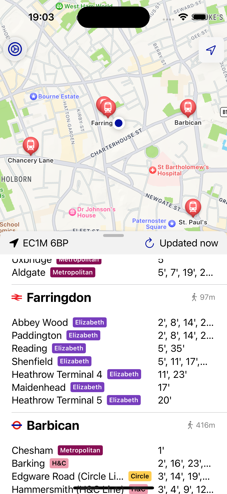
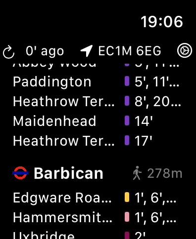

# Departures iOS

This is an iOS (with widget) and watchOS app to display data upcoming TfL departures for a user's location using the [Departures backend](https://github.com/vinayh/departures-backend). The app is currently in progress but is functional, allowing a user to select the types of stations and modes of transport they would like to see displayed and auto-updating on location changes, with a watchOS app that works without a connected phone.

## iOS app

## watchOS app

